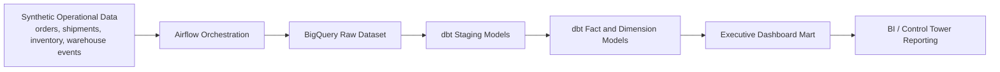

# Supply Chain Control Tower

`Supply Chain Control Tower` is a portfolio project that simulates a modern logistics analytics platform for operations teams. It unifies shipment execution, inventory position, warehouse throughput, and service-level performance into a decision-ready analytics layer.

This project is intentionally designed to feel like a production-minded data engineering system, not a notebook demo. It combines:

- `GCP / BigQuery` for warehousing
- `Airflow` for orchestration
- `dbt` for transformations, tests, and freshness checks
- `SQL` for metric modeling
- `Python` for synthetic data generation and ingestion utilities

## What This Project Demonstrates

This repository is meant to show more than tool familiarity. It demonstrates how a data engineer can:

- design a domain-specific analytics product for supply chain operations
- build a repeatable ingestion and transformation pipeline
- separate orchestration, data modeling, and quality enforcement cleanly
- model business-facing KPIs rather than just raw tables
- move from local development to a Dockerized Airflow runtime

## Business Problem

Operations leaders often need a single place to answer questions like:

- Which shipments are at risk of being delivered late?
- Which warehouses are building backlog?
- Where are we likely to stock out in the next few days?
- Which carriers or lanes are underperforming?

In many teams, those answers are split across ERP, WMS, TMS, and spreadsheet workflows. This project models a control tower layer that standardizes those signals into curated marts for monitoring and analysis.

## Current Scope

The current version includes:

- synthetic logistics source data for orders, shipments, inventory snapshots, and warehouse events
- a Python utility to generate realistic CSV source files
- an Airflow DAG that automates `local file -> BigQuery raw -> dbt build`
- a dbt project with staging, fact, dimension, and dashboard-facing mart models
- Windows-friendly Docker Desktop support for the Airflow UI and scheduler

## Project Status

This project has been validated end-to-end in the current environment:

- `dbt run`, `dbt test`, and `dbt source freshness` pass
- BigQuery raw and curated datasets are loaded successfully
- Airflow tasks run successfully for dataset creation, raw loads, and `dbt build`
- Docker Desktop Airflow UI is working on Windows

## Target Architecture

See [docs/architecture.md](C:\Users\suhas\OneDrive\Documents\New project\docs\architecture.md:1) for the deeper walkthrough.

High-level flow:

1. Python generates or ingests operational data
2. Raw files land in a bronze-style layer
3. Airflow orchestrates ingestion and transformations
4. dbt builds staging, metrics, and curated dashboard marts
5. BI tools or dashboards query the executive control tower model



## Key Models

Core fact models:

- `fct_otif_daily`
- `fct_backlog_daily`
- `fct_inventory_risk_daily`

Dimensions:

- `dim_warehouse`
- `dim_carrier`
- `dim_sku`

Dashboard and drilldown marts:

- `control_tower_executive_dashboard`
- `mart_warehouse_performance_daily`
- `mart_carrier_performance_daily`
- `mart_sku_inventory_risk_daily`

## KPIs Modeled

- `delivered_shipments`
- `on_time_shipments`
- `late_shipments`
- `on_time_rate`
- `in_full_rate`
- `otif_rate`
- `backlog_orders`
- `backlog_units`
- `backlog_rate`
- `inventory_at_risk_units`
- `inventory_below_reorder_sku_count`
- `inventory_risk_rate`
- `warehouse_pick_delay_events`

## Data Quality Coverage

The dbt layer includes:

- source freshness checks
- not-null and uniqueness tests
- accepted-value tests for operational statuses
- relationship tests across orders, shipments, and warehouse events
- custom singular tests for invalid dates, negative quantities, negative measures, and out-of-bounds rates

This helps position the project as a reliability-conscious engineering system rather than just a reporting demo.

## Repository Layout

- `airflow/`: orchestration assets
- `data/raw/`: synthetic source files
- `dbt/control_tower/`: dbt project
- `docker/`: Docker runtime assets for Airflow
- `docs/`: architecture and setup notes
- `src/`: Python utilities and ingestion logic

## Running The Project

### Local dbt / BigQuery Workflow

1. Create a Python environment and install dependencies from `requirements.txt`
2. Generate source data:

```powershell
python -m src.data.generate_sample_data
```

3. Load raw data into BigQuery
4. Run dbt models and tests
5. Query `control_tower_executive_dashboard` for reporting

The local Airflow + BigQuery setup guide is in [docs/airflow_gcp_setup.md](C:\Users\suhas\OneDrive\Documents\New project\docs\airflow_gcp_setup.md:1).

### Airflow Runtime Options

- Native Windows task testing: useful for `airflow tasks test` and local verification
- Docker Desktop: recommended on Windows for the full Airflow UI and scheduler
- Cloud Composer: recommended production-style deployment target

Docker Desktop setup instructions are in [docs/airflow_docker_desktop_setup.md](C:\Users\suhas\OneDrive\Documents\New project\docs\airflow_docker_desktop_setup.md:1).

## Design Decisions

- `BigQuery` is used as both raw landing and analytics warehouse to keep the local workflow simple while staying aligned to a realistic cloud pattern.
- `dbt` owns transformation logic, metric modeling, tests, and freshness checks so business logic stays versioned and reviewable.
- `Airflow` is responsible for orchestration rather than transformation logic, which keeps the pipeline easier to maintain.
- synthetic data keeps the project portable and public-shareable while still reflecting realistic logistics workflows.
- `GCS` is intentionally deferred for now so the project remains runnable in a lower-cost setup; the architecture still leaves room to add it later.

## Suggested Screenshots To Add

The next README improvement should be screenshots for:

- Airflow DAG Graph view showing a successful run
- BigQuery raw dataset and curated mart tables
- dbt test or freshness success output
- a sample query result from `control_tower_executive_dashboard`

## Production Evolution

If this were promoted beyond portfolio scope, the next steps would be:

- add `GCS` as a true landing zone
- partition raw and curated tables by date
- add alerting, lineage metadata, and row-count audit checks
- run orchestration in `Cloud Composer`
- add dashboarding in `Looker Studio` or `Streamlit`

## Why It Matters For My Portfolio

This project is designed to show:

- strong logistics and supply chain domain context
- data platform design thinking
- production-style orchestration and transformation structure
- business-facing metric design
- clear repo organization and documentation

## Next Enhancements

- add a dashboard in `Looker Studio` or `Streamlit`
- include screenshots and sample outputs in this README
- add anomaly detection on delays and backlog
- add forecasting or exception-based alerting
