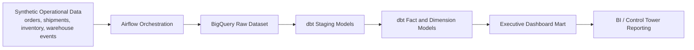

# Supply Chain Control Tower

`Supply Chain Control Tower` is a portfolio project that simulates a modern logistics analytics platform for operations teams. The goal is to unify shipment execution, inventory position, warehouse throughput, and service-level metrics into a decision-ready data model.

This project is intentionally designed to feel like a production-minded data engineering repository, not a notebook demo. It uses:

- `GCP` as the target cloud platform
- `Airflow` for orchestration
- `dbt` for transformations and tests
- `SQL` for dimensional and metric modeling
- `Python` for synthetic data generation and ingestion utilities

## Business Problem

Operations leaders often need a single place to answer questions like:

- Which shipments are at risk of being delivered late?
- Which warehouses are building backlog?
- Where are we likely to stock out in the next few days?
- Which carriers or lanes are underperforming?

In many teams, those answers are spread across raw ERP, WMS, and TMS extracts. This project models a control tower layer that standardizes those signals into curated marts.

## Scope

The starter version of the project includes:

- Synthetic logistics source data for orders, shipments, inventory snapshots, and warehouse events
- A Python utility to generate realistic CSV source files
- An Airflow DAG that automates `local file -> BigQuery raw -> dbt build`
- A dbt project with staging and mart models
- A dashboard-facing metrics layer for OTIF, backlog, and inventory risk

## Target Architecture

See [docs/architecture.md](C:\Users\suhas\OneDrive\Documents\New project\docs\architecture.md:1) for a fuller walkthrough.

High-level flow:

1. Python generates or ingests raw operational data
2. Raw files land in a bronze-style layer
3. Airflow orchestrates ingestion and transformations
4. dbt builds staging, metrics, and curated dashboard marts
5. BI tools or dashboards query the executive control tower model



## Why This Project Exists

This repository is meant to show more than tool familiarity. It demonstrates how a data engineer can take fragmented logistics signals and turn them into a decision-ready analytics product with:

- clear source-to-mart lineage
- orchestration and repeatability
- data quality and freshness checks
- domain-oriented KPI design
- a path from local development to production deployment

## Repository Layout

- `airflow/`: orchestration assets
- `data/raw/`: synthetic source files
- `dbt/control_tower/`: dbt project
- `docs/`: architecture and project notes
- `src/`: Python utilities

## Metrics Layer

The dbt mart layer separates reusable business metrics from dashboard-facing output:

- `fct_otif_daily`: OTIF-style shipment service metrics by warehouse
- `fct_backlog_daily`: open-order backlog and unshipped unit metrics
- `fct_inventory_risk_daily`: low-stock and reorder-risk metrics
- `control_tower_executive_dashboard`: combined KPI mart for BI dashboards

Additional marts support deeper operational slicing:

- `mart_warehouse_performance_daily`
- `mart_carrier_performance_daily`
- `mart_sku_inventory_risk_daily`

Supporting dimensions:

- `dim_warehouse`
- `dim_carrier`
- `dim_sku`

## KPIs Modeled

- `delivered_shipments`
- `on_time_shipments`
- `late_shipments`
- `on_time_rate`
- `in_full_rate`
- `otif_rate`
- `backlog_orders`
- `backlog_units`
- `backlog_rate`
- `inventory_at_risk_units`
- `inventory_below_reorder_sku_count`
- `inventory_risk_rate`
- `warehouse_pick_delay_events`

## Quick Start

1. Create a Python environment and install dependencies from `requirements.txt`
2. Generate source data:

```powershell
python -m src.data.generate_sample_data
```

3. Review the generated files in `data/raw/`
4. Point your Airflow and dbt local setup at the generated data or your warehouse tables
5. Run the DAG and build dbt models
6. Query `control_tower_executive_dashboard` for dashboards or reporting

## Airflow Ingestion Flow

The orchestration flow is designed to mirror a production-style landing pattern:

1. Generate or refresh local sample CSVs
2. Validate expected source files
3. Ensure the BigQuery `raw` dataset exists
4. Load local CSVs into BigQuery raw tables
5. Run `dbt build` to refresh staging, marts, and tests

Set these environment variables before running the DAG locally or in Composer:

- `CONTROL_TOWER_GCP_PROJECT`
- `CONTROL_TOWER_RAW_DATASET`
- `CONTROL_TOWER_BQ_LOCATION`
- `DBT_PROFILES_DIR`

`GCS` can be added later as a landing layer once billing is enabled. The current version keeps the pipeline runnable in a low-cost local setup.

## Airflow Runtime Options

- Native Windows task testing: useful for `airflow tasks test` and local verification
- Docker Desktop: recommended on Windows for the full Airflow UI and scheduler
- Cloud Composer: recommended production-style deployment target

Docker Desktop setup instructions are in [docs/airflow_docker_desktop_setup.md](C:\Users\suhas\OneDrive\Documents\New project\docs\airflow_docker_desktop_setup.md:1).

## Design Decisions

- `BigQuery` is used as both the raw landing and analytics warehouse to keep the local portfolio workflow simple while staying aligned to a real cloud pattern.
- `dbt` owns transformation logic, tests, and metric-layer modeling so business logic stays versioned and reviewable.
- `Airflow` is responsible for orchestration rather than transformation logic, which keeps the pipeline easier to maintain.
- Synthetic data is used so the project stays portable and safe to share publicly while still reflecting realistic logistics workflows.

## Production Evolution

If this were promoted beyond portfolio scope, the next steps would be:

- add `GCS` as a true landing zone
- partition raw and curated tables by date
- add alerting, lineage metadata, and row-count audit checks
- run orchestration in `Cloud Composer`
- add dashboarding in `Looker Studio` or `Streamlit`

## Portfolio Positioning

This project is meant to demonstrate:

- Strong logistics and supply chain domain context
- Data platform design thinking
- Production-style orchestration and transformation structure
- Business-facing metric design
- Clear repo organization and documentation

## Next Steps

Good follow-up enhancements:

- Add anomaly detection on delays and backlog
- Add dashboard assets in Looker Studio or Streamlit
- Add carrier- and lane-level drilldowns
- Add forecasting or exception-based alerting
