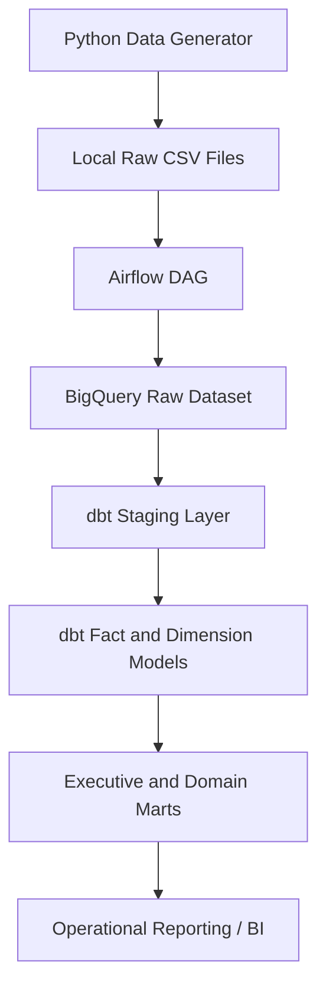

# Architecture Overview

## Use Case

The control tower is intended for supply chain, transportation, and warehouse leaders who want a near-real-time operational view of fulfillment performance.

## System Goal

The goal of the architecture is to convert fragmented operational records into a consistent analytics layer that supports fulfillment, inventory, and transportation decisions. The design intentionally separates ingestion, standardization, metric calculation, and dashboard consumption so each layer has a clear responsibility.

## End-to-End Flow

## Source Domains

- `orders`: customer order line commitments
- `shipments`: shipment execution and promised dates
- `inventory_snapshots`: daily stock position by warehouse and SKU
- `warehouse_events`: operational scans and task events

## Medallion-Style Flow

### Bronze

Raw source extracts are generated locally as CSV files and loaded into a BigQuery `raw` dataset by Airflow. This keeps the project runnable without Cloud Storage billing while preserving the same bronze-to-silver-to-gold design.

### Silver

dbt staging models standardize column names, timestamps, and status logic.

Staging responsibilities:

- normalize types and field names
- create a stable contract for downstream models
- enforce source-level tests and freshness checks
- separate raw ingestion concerns from business logic

### Gold

Curated marts produce control tower metrics for daily operational monitoring.

### Metrics Layer Design

The mart layer is split into reusable KPI tables so dashboards do not depend on a single monolithic model:

- `fct_otif_daily`: service metrics such as delivered, on-time, late, in-full, and OTIF rates
- `fct_backlog_daily`: backlog orders and backlog units by warehouse
- `fct_inventory_risk_daily`: on-hand, reorder-risk, and low-stock exposure by warehouse
- `control_tower_executive_dashboard`: dashboard-ready wide table for operational BI

Additional analytical marts support deeper investigation:

- `mart_warehouse_performance_daily`
- `mart_carrier_performance_daily`
- `mart_sku_inventory_risk_daily`

Dimensions provide reusable business context:

- `dim_warehouse`
- `dim_carrier`
- `dim_sku`

## Control Tower Questions

The mart is designed to answer:

- Which sites are most delayed today?
- Which shipments missed promise date?
- Which SKUs are below reorder threshold?
- Which warehouses are accumulating unpicked demand?

## Core Metric Definitions

- `late_shipment_rate`: late shipments divided by all delivered shipments
- `backlog_units`: order quantity not yet shipped for open orders
- `inventory_at_risk_units`: inventory units where on hand is at or below reorder point
- `warehouse_pick_delay_events`: warehouse picks started after SLA threshold

## Data Quality Strategy

The project treats data quality as part of the architecture rather than an afterthought.

Current controls include:

- source freshness checks
- uniqueness and not-null tests
- accepted-value tests for operational statuses
- relationship tests between orders, shipments, and warehouse events
- custom singular tests for invalid dates, negative measures, and out-of-bounds rates

This makes the repository easier to present as a production-minded engineering project rather than a reporting demo.

## Suggested GCP Deployment

- `Cloud Storage`: raw landing
- `BigQuery`: bronze, silver, and mart datasets
- `Cloud Composer`: managed Airflow
- `dbt Core`: transformations executed from Composer or CI
- `Looker Studio`: operational dashboard

## Orchestration Design

The Airflow DAG is structured as:

1. `generate_source_data`
2. `validate_raw_files`
3. `ensure_bigquery_raw_dataset`
4. `load_raw_tables_from_local_files`
5. `build_dbt_models`

This makes the project easier to explain as a true ingestion-and-transformation pipeline rather than a set of disconnected scripts.

## Design Tradeoffs

- Local raw-file loading was chosen over `GCS` for now to keep the project runnable without billing blockers.
- The warehouse-level executive mart is intentionally wide so dashboards can be built quickly, while detailed marts still preserve drilldown capability.
- Synthetic data is used to avoid sharing proprietary operational data while preserving realistic logistics semantics.

## Production-Ready Evolution

In a fuller production implementation, this design would evolve by:

1. landing source extracts in `GCS`
2. partitioning BigQuery raw and curated tables
3. adding Composer scheduling, alerting, and retry policies
4. adding observability tables for load audits and SLA tracking
5. layering BI semantic definitions or metric contracts on top of the marts

## Future Enhancements

- Add weather and holiday enrichment
- Add event-driven delay alerts
- Add forecasting and ETA prediction outputs
